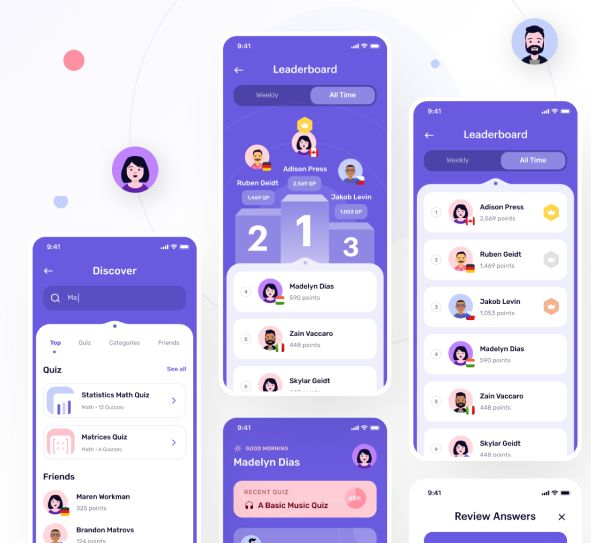

# DuelQuiz App

## 🎉 Sobre o Projeto

**DuelQuiz App** é um jogo de quiz interativo onde os jogadores competem em tempo real para responder perguntas de conhecimento geral. O aplicativo desafia o intelecto e oferece uma experiência divertida de aprendizagem, permitindo que os jogadores testem suas habilidades contra oponentes.

## 🚀 Funcionalidades

- **Escolha e Jogue**: Selecione diferentes quizzes de categorias variadas e jogue contra oponentes ao vivo.
- **Cronômetro**: Responda cada pergunta dentro de um limite de tempo para ganhar pontos.
- **Pontuação ao Vivo**: Veja quem está na frente à medida que cada pergunta é respondida.
- **Modal de Resultados**: No final de cada jogo, um modal de resultados mostra quem ganhou, exibindo uma animação Lottie se você ganhar.

<!-- ## 📸 Capturas de Tela

 -->

## 🛠️ Tecnologias Utilizadas

- **React Native**: Framework principal para desenvolvimento de aplicativos móveis.
- **Expo**: Ferramenta para facilitar o desenvolvimento e a distribuição do aplicativo.
- **Lottie**: Para animações envolventes e personalizadas.
- **JavaScript**: Linguagem principal de programação.

## ⚙️ Instalação

1. **Clone o Repositório**

   \`\`\`bash
   git clone https://github.com/pedrogiampietro/eaiquiz.git
   cd duelquiz-app
   \`\`\`

2. **Instale as Dependências**

   Certifique-se de ter o \`npm\` instalado e execute:

   \`\`\`bash
   npm install
   \`\`\`

   Ou, se estiver usando o \`yarn\`:

   \`\`\`bash
   yarn install
   \`\`\`

3. **Inicie o Projeto**

   Com o Expo CLI instalado, execute:

   \`\`\`bash
   npx expo start
   \`\`\`

   Isso abrirá o Expo Developer Tools no navegador. A partir daqui, você pode executar o aplicativo em um emulador ou dispositivo físico.

## 📂 Estrutura de Pastas

\`\`\`
/duelquiz-app
/assets - mask-group-profile.png - win-animation.json - loser.png - trophy.png
/components - CustomHeader.js
/screens - Discover.js - DuelQuiz.js
App.js
README.md
package.json
\`\`\`

- **/assets**: Contém imagens, ícones e animações usadas no app.
- **/components**: Componentes reutilizáveis usados em várias partes do app.
- **/screens**: Contém as telas principais do aplicativo, como \`Discover\` e \`DuelQuiz\`.

## 🤝 Contribuição

Contribuições são sempre bem-vindas! Para contribuir:

1. **Fork** o projeto
2. **Crie** sua Feature Branch (\`git checkout -b feature/nova-feature\`)
3. **Commit** suas alterações (\`git commit -m 'Adicionando nova feature'\`)
4. **Push** para a branch (\`git push origin feature/nova-feature\`)
5. **Abra** um Pull Request

## 📝 Licença

Este projeto está sob a licença MIT. Veja o arquivo [LICENSE](LICENSE) para mais detalhes.

## 📧 Contato

Se você tiver alguma dúvida ou sugestão, sinta-se à vontade para entrar em contato:

- **Nome**: Pedro Giampietro
- **GitHub**: [pedrogiampietro](https://github.com/pedrogiampietro)
